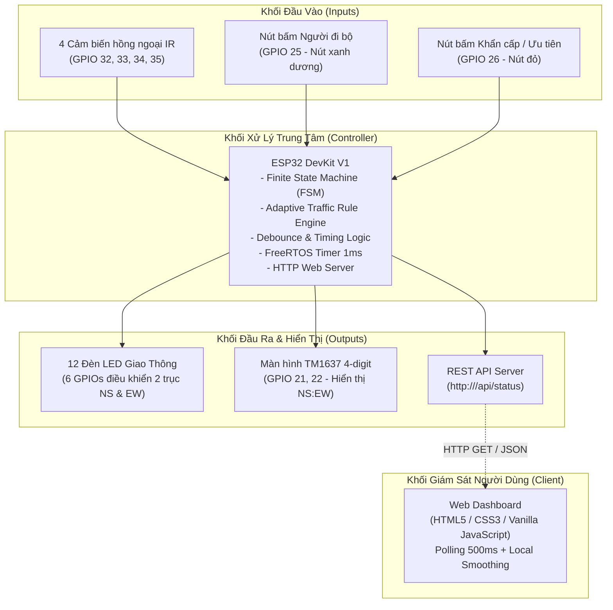
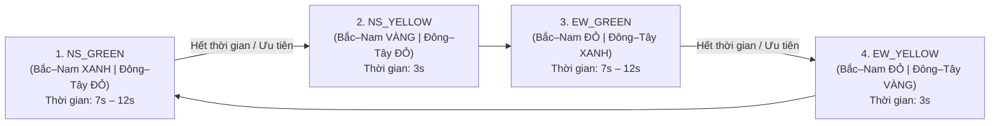

# 🚦 Smart Traffic Light System
### Hệ thống Đèn Giao Thông Thông Minh Sử Dụng ESP32

[](https://www.espressif.com/)
[](https://opensource.org/licenses/MIT)
[](https://www.arduino.cc/)
[](https://developer.mozilla.org/)

Hệ thống điều khiển và giám sát đèn giao thông thông minh thời gian thực cho ngã tư 4 hướng, phát triển trên nền tảng vi điều khiển **ESP32 DevKit V1**. Hệ thống tích hợp thuật toán điều khiển thích ứng theo mật độ xe dựa trên 4 cảm biến hồng ngoại (IR), nút bấm ưu tiên người đi bộ và xe khẩn cấp, hiển thị đếm lùi trên màn hình TM1637 và Web Dashboard giám sát trực quan qua mạng Wi-Fi.

Mô hình vật lý ngã tư giao thông được chế tác bằng chất liệu **bìa carton** phục vụ mục đích thực nghiệm và trình diễn đồ án học phần Hệ thống nhúng.

---

## 📑 Mục lục

1. [Giới thiệu đề tài](#1-giới-thiệu-đề-tài)
2. [Tính năng hiện tại](#2-tính-năng-hiện-tại)
3. [Kiến trúc hệ thống](#3-kiến-trúc-hệ-thống)
4. [Danh mục linh kiện phần cứng](#4-danh-mục-linh-kiện-phần-cứng)
5. [Sơ đồ kết nối chân (GPIO Mapping)](#5-sơ-đồ-kết-nối-chân-gpio-mapping)
6. [Máy trạng thái hữu hạn (FSM)](#6-máy-trạng-thái-hữu-hạn-fsm)
7. [Thuật toán điều khiển thích ứng (Adaptive Traffic Control)](#7-thuật-toán-điều-khiển-thích-ứng-adaptive-traffic-control)
8. [Chế độ Người đi bộ & Ưu tiên khẩn cấp](#8-chế-độ-người-đi-bộ--ưu-tiên-khẩn-cấp)
9. [Màn hình đếm lùi TM1637](#9-màn-hình-đếm-lùi-tm1637)
10. [REST Web API của ESP32](#10-rest-web-api-của-esp32)
11. [Web Dashboard giám sát thời gian thực](#11-web-dashboard-giám-sát-thời-gian-thực)
12. [Cấu trúc thư mục repository](#12-cấu-trúc-thư-mục-repository)
13. [Hướng dẫn cài đặt và vận hành](#13-hướng-dẫn-cài-đặt-và-vận-hành)
14. [Hình ảnh minh họa (Screenshots)](#14-hình-ảnh-minh-họa-screenshots)
15. [Định hướng phát triển (Roadmap)](#15-định-hướng-phát-triển-roadmap)
16. [Lưu ý thiết kế & Giới hạn mô hình](#16-lưu-ý-thiết-kế--giới-hạn-mô-hình)
17. [Tác giả & Bản quyền](#17-tác-giả--bản-quyền)

---

## 1. Giới thiệu đề tài

Hệ thống mô phỏng một nút giao thông 4 hướng:
- **North (Bắc)**
- **South (Nam)**
- **East (Đông)**
- **West (Tây)**

Hai hướng đối diện được ghép chung pha điều khiển để tối ưu chân vi điều khiển:
- **Trục Bắc – Nam (NS):** Hướng North và South hoạt động cùng pha tín hiệu đèn.
- **Trục Đông – Tây (EW):** Hướng East và West hoạt động cùng pha tín hiệu đèn.

Bộ điều khiển trung tâm **ESP32** tiếp nhận tín hiệu từ 4 cảm biến hồng ngoại phát hiện phương tiện ở các làn xe, phân tích mật độ xe tại từng trục, sau đó tự động căn chỉnh thời gian pha đèn xanh một cách thích ứng (Adaptive Rule-Based Control) nhằm giải tỏa lưu lượng giao thông hiệu quả nhất. Đồng thời, ESP32 đóng vai trò một HTTP Web Server cung cấp REST API trạng thái để Web Dashboard có thể giám sát realtime từ xa.

---

## 2. Tính năng hiện tại

- 🟢 **Điều khiển tự động 4 hướng đèn giao thông:** Quản lý 4 cụm đèn (tổng cộng 12 đèn LED: 4 Đỏ, 4 Vàng, 4 Xanh) qua 6 chân GPIO.
- ⚡ **Thuật toán FSM 4 trạng thái:** Chu trình chuyển đổi mượt mà, loại bỏ pha đèn đỏ toàn phần (ALL-RED) phù hợp với thực tế mô hình.
- 🚗 **Giám sát mật độ xe với 4 cảm biến IR:** Đo lường sự hiện diện của xe trên cả 2 trục NS và EW (`EMPTY`, `LOW`, `HIGH`).
- ⏱️ **Điều chỉnh thời gian đèn xanh thích ứng (Adaptive Green Time):** Tự động gia hạn thời gian đèn xanh (12s) cho hướng đông xe hơn và rút ngắn thời gian đèn xanh (7s) cho hướng ít xe hơn.
- 🚶 **Nút bấm vật lý dành cho người đi bộ (Pedestrian Button):** Ghi nhận yêu cầu băng qua đường và chuyển đổi pha đèn an toàn với thời gian ưu tiên 12s.
- 🚑 **Nút bấm vật lý ưu tiên khẩn cấp (Priority / Emergency Button):** Dành cho xe ưu tiên (cứu thương, cứu hỏa), ép chu trình chuyển nhanh về pha xanh ưu tiên với thời gian 15s.
- 🔢 **Màn hình LED 7 đoạn TM1637:** Hiển thị đồng thời countdown của cả 2 hướng theo định dạng `NS:EW` (ví dụ: `08:05`).
- 📡 **Tích hợp Web Server & REST API:** Cung cấp endpoint JSON `/api/status` phản hồi dữ liệu chi tiết sau mỗi chu kỳ polling 500ms.
- 💻 **Web Dashboard thời gian thực:** Giao diện tối giản (Dark mode), hiển thị 2 cột trực quan, đồng bộ countdown số lớn, đếm số cảm biến phát hiện xe, thông báo sự kiện (Event Log) và hỗ trợ responsive trên cả máy tính lẫn điện thoại di động.

---

## 3. Kiến trúc hệ thống



---

## 4. Danh mục linh kiện phần cứng

| STT | Tên linh kiện | Số lượng | Mô tả / Thông số kỹ thuật |
| :---: | :--- | :---: | :--- |
| 1 | **ESP32 DevKit V1** | 1 | Vi điều khiển 32-bit dual-core, tích hợp Wi-Fi 2.4GHz & Bluetooth |
| 2 | **Đèn LED Đỏ (Red)** | 4 | Đèn báo dừng (đường kính 5mm) |
| 3 | **Đèn LED Vàng (Yellow)** | 4 | Đèn báo chuẩn bị dừng (đường kính 5mm) |
| 4 | **Đèn LED Xanh (Green)** | 4 | Đèn báo được phép di chuyển (đường kính 5mm) |
| 5 | **Điện trở hạn dòng** | 12 | Trở kháng 220Ω, bảo vệ LED |
| 6 | **Module cảm biến hồng ngoại IR** | 4 | Module so sánh LM393, khoảng cách nhận diện 2 – 30cm, ngõ ra Active LOW |
| 7 | **Module LED 7 đoạn TM1637** | 1 | 4 chữ số, giao tiếp 2 dây (CLK, DIO), có dấu hai chấm `:` ở giữa |
| 8 | **Nút nhấn nhả (Push Button)** | 2 | 1 nút Xanh dương (Người đi bộ), 1 nút Đỏ (Ưu tiên khẩn cấp) |
| 9 | **Breadboard (Bo test)** | 1-2 | Bo cắm mạch thử nghiệm không cần hàn |
| 10 | **Dây nối cắm breadboard** | Nhiều | Dây đực-đực, đực-cái, cái-cái |
| 11 | **Cáp nạp & cấp nguồn** | 1 | Cáp Micro-USB kết nối máy tính hoặc nguồn 5V/2A |
| 12 | **Mô hình ngã tư** | 1 | Sa bàn ngã tư làm bằng chất liệu **bìa carton** |

---

## 5. Sơ đồ kết nối chân (GPIO Mapping)

### Bảng phân bố chân GPIO trên ESP32:

| Khối chức năng | Tên tín hiệu | GPIO ESP32 | Chế độ chân | Ghi chú kết nối |
| :--- | :--- | :---: | :---: | :--- |
| **Đèn Trục Bắc – Nam (NS)** | `NS_RED` | **GPIO 13** | `OUTPUT` | Điều khiển chung 2 đèn Đỏ hướng Bắc & Nam |
| | `NS_YELLOW` | **GPIO 14** | `OUTPUT` | Điều khiển chung 2 đèn Vàng hướng Bắc & Nam |
| | `NS_GREEN` | **GPIO 16** | `OUTPUT` | Điều khiển chung 2 đèn Xanh hướng Bắc & Nam |
| **Đèn Trục Đông – Tây (EW)** | `EW_RED` | **GPIO 17** | `OUTPUT` | Điều khiển chung 2 đèn Đỏ hướng Đông & Tây |
| | `EW_YELLOW` | **GPIO 18** | `OUTPUT` | Điều khiển chung 2 đèn Vàng hướng Đông & Tây |
| | `EW_GREEN` | **GPIO 19** | `OUTPUT` | Điều khiển chung 2 đèn Xanh hướng Đông & Tây |
| **Màn hình TM1637** | `DIO` | **GPIO 21** | `OUTPUT` | Chân dữ liệu Data I/O |
| | `CLK` | **GPIO 22** | `OUTPUT` | Chân xung nhịp Clock |
| **Nút bấm điều khiển** | `Pedestrian` | **GPIO 25** | `INPUT_PULLUP` | Nút xanh dương; Nhấn = `LOW`, Thả = `HIGH` |
| | `Priority` | **GPIO 26** | `INPUT_PULLUP` | Nút đỏ; Nhấn = `LOW`, Thả = `HIGH` |
| **Cảm biến hồng ngoại IR** | `IR_NS1` | **GPIO 32** | `INPUT` | Cảm biến 1 làn Bắc – Nam (Active LOW) |
| | `IR_NS2` | **GPIO 33** | `INPUT` | Cảm biến 2 làn Bắc – Nam (Active LOW) |
| | `IR_EW1` | **GPIO 34** | `INPUT` | Cảm biến 1 làn Đông – Tây (GPI-only pin, Active LOW) |
| | `IR_EW2` | **GPIO 35** | `INPUT` | Cảm biến 2 làn Đông – Tây (GPI-only pin, Active LOW) |

> **Nguyên lý mức tín hiệu:**
> - **Nút bấm:** Cấu hình `INPUT_PULLUP`. Chân GPIO được kéo lên 3.3V khi thả (HIGH), khi nhấn nút sẽ nối xuống GND (LOW). Thuật toán debounce phần mềm xử lý chống rung phím với ngưỡng thời gian 35ms.
> - **Cảm biến IR:** Cấu hình `IR_ACTIVE_LOW = true`. Khi có vật cản (xe), chân OUT của module LM393 xuất mức `LOW`. Khi đường trống, chân OUT xuất mức `HIGH`.
> - **GPIO 34 và GPIO 35:** Là các chân chỉ nhận ngõ vào (Input-only pins) trên ESP32, rất thích hợp để nhận tín hiệu số từ cảm biến hồng ngoại.

---

## 6. Máy trạng thái hữu hạn (FSM)

Hệ thống hoạt động trên máy trạng thái hữu hạn (FSM) gồm đúng **4 trạng thái tuần tự**, hoàn toàn loại bỏ pha ALL-RED nhằm đảm bảo lưu thông liên tục:



### Bảng chi tiết trạng thái FSM:

| Trạng thái FSM | Đèn Trục Bắc – Nam (NS) | Đèn Trục Đông – Tây (EW) | Thời gian mặc định | Ý nghĩa hoạt động |
| :--- | :---: | :---: | :---: | :--- |
| `NS_GREEN` | **GREEN (Xanh)** | **RED (Đỏ)** | 7s – 12s (Tùy mật độ) | Phương tiện trục Bắc – Nam được phép lưu thông |
| `NS_YELLOW` | **YELLOW (Vàng)** | **RED (Đỏ)** | 3s | Phương tiện trục Bắc – Nam giảm tốc độ và dừng |
| `EW_GREEN` | **RED (Đỏ)** | **GREEN (Xanh)** | 7s – 12s (Tùy mật độ) | Phương tiện trục Đông – Tây được phép lưu thông |
| `EW_YELLOW` | **RED (Đỏ)** | **YELLOW (Vàng)** | 3s | Phương tiện trục Đông – Tây giảm tốc độ và dừng |

---

## 7. Thuật toán điều khiển thích ứng (Adaptive Traffic Control)

Hệ thống không sử dụng AI phức tạp mà triển khai giải thuật điều khiển thích ứng dựa trên tập luật (Adaptive Rule-Based Control) chạy trực tiếp trên vi điều khiển:

### 1. Phân loại mật độ phương tiện:
Mật độ được tính bằng tổng số cảm biến IR phát hiện xe trên từng trục:
- $\text{Mật độ NS} = \text{IR\_NS1} + \text{IR\_NS2} \in \{0, 1, 2\}$
- $\text{Mật độ EW} = \text{IR\_EW1} + \text{IR\_EW2} \in \{0, 1, 2\}$

| Số cảm biến phát hiện xe | Mức mật độ (`density`) | Ý nghĩa lưu lượng |
| :---: | :---: | :--- |
| 0 cảm biến | `EMPTY` | Tuyến đường hoàn toàn thông thoáng |
| 1 cảm biến | `LOW` | Mật độ xe trung bình thấp |
| 2 cảm biến | `HIGH` | Mật độ xe đông, có nguy cơ ùn ứ |

### 2. Bảng quy tắc thích ứng thời gian đèn xanh:

Cấu hình thời gian trong firmware:
- `GREEN_NORMAL_TIME = 10000;` (10 giây)
- `GREEN_LONG_TIME   = 12000;` (12 giây)
- `GREEN_SHORT_TIME  = 7000;`  (7 giây)
- `YELLOW_TIME       = 3000;`  (3 giây)

| Điều kiện so sánh mật độ | Thời gian xanh NS | Thời gian xanh EW | Rationale |
| :--- | :---: | :---: | :--- |
| **Mật độ NS > Mật độ EW** | `GREEN_LONG_TIME` (12s) | `GREEN_SHORT_TIME` (7s) | Tăng thời gian giải phóng trục NS đang đông |
| **Mật độ EW > Mật độ NS** | `GREEN_SHORT_TIME` (7s) | `GREEN_LONG_TIME` (12s) | Tăng thời gian giải phóng trục EW đang đông |
| **Mật độ NS == Mật độ EW** | `GREEN_NORMAL_TIME` (10s) | `GREEN_NORMAL_TIME` (10s) | Cân bằng lưu lượng đều giữa hai hướng |

**Ví dụ thực tế:**
- `IR_NS1 = true`, `IR_NS2 = true` $\rightarrow$ Mật độ NS = 2 (`HIGH`).
- `IR_EW1 = true`, `IR_EW2 = false` $\rightarrow$ Mật độ EW = 1 (`LOW`).
- **Kết quả:** Trục NS được cấp 12 giây đèn xanh; trục EW sau đó chỉ nhận 7 giây đèn xanh.

---

## 8. Chế độ Người đi bộ & Ưu tiên khẩn cấp

### 🚶 1. Chế độ Người đi bộ (Pedestrian Mode)
- **Nút bấm vật lý:** GPIO 25 (Nút màu xanh dương trên mô hình).
- **Trục cấu hình hiện tại:** `PEDESTRIAN_AXIS = AXIS_NS` (có thể đổi sang `AXIS_EW` trong firmware).
- **Cơ chế hoạt động:**
  - Khi người đi bộ bấm nút, cờ `pedestrianRequest = true`.
  - Nếu hướng ưu tiên đang xanh: Thời gian xanh được kéo dài đạt `PEDESTRIAN_GREEN_TIME = 12000` (12 giây) để người đi bộ qua đường an toàn.
  - Nếu hướng ưu tiên đang đỏ: Chờ tối thiểu `MIN_GREEN_BEFORE_FORCED_SWITCH = 3000` (3 giây) ở hướng hiện tại trước khi chuyển sang pha vàng rồi bật xanh hướng có người đi bộ.
  - Sau khi phục vụ xong, cờ yêu cầu được tự động xóa.

### 🚑 2. Chế độ Ưu tiên khẩn cấp (Priority / Emergency Mode)
- **Nút bấm vật lý:** GPIO 26 (Nút màu đỏ trên mô hình).
- **Trục cấu hình hiện tại:** `PRIORITY_AXIS = AXIS_NS` (có thể đổi sang `AXIS_EW` trong firmware).
- **Cơ chế hoạt động:**
  - Chế độ ưu tiên khẩn cấp có cấp độ quyền ưu tiên **cao hơn** chế độ người đi bộ.
  - Khi xe ưu tiên đến và nút đỏ được nhấn: Cờ `priorityRequest = true`.
  - Nếu hướng xe ưu tiên đang xanh: Ngay lập tức gia hạn thời gian xanh lên `PRIORITY_GREEN_TIME = 15000` (15 giây).
  - Nếu hướng xe ưu tiên đang đỏ: Ép pha hiện tại chuyển sang đèn vàng sau 3 giây tối thiểu, sau đó kích hoạt ngay đèn xanh cho hướng xe ưu tiên.
  - Web Dashboard sẽ lập tức hiển thị cảnh báo đỏ nổi bật: `ƯU TIÊN KHẨN CẤP ĐANG KÍCH HOẠT`.

---

## 9. Màn hình đếm lùi TM1637

Module TM1637 kết nối với ESP32 qua chân `CLK = GPIO 22` và `DIO = GPIO 21`.

Màn hình hiển thị thời gian đếm lùi thực tế của cả 2 trục đồng thời theo định dạng:

$$\mathbf{NS : EW}$$

```text
[ 0 8 : 0 5 ]
  │ │ │ │ │
  │ │ │ └─┴── Countdown hướng Đông – Tây (5 giây)
  │ │ └────── Dấu hai chấm phân cách (:)
  └─┴──────── Countdown hướng Bắc – Nam (8 giây)
```

- Trong pha `NS_GREEN`: NS đếm thời gian xanh còn lại; EW đếm tổng thời gian đỏ (thời gian xanh còn lại của NS + 3 giây vàng của NS).
- Trong pha `NS_YELLOW`: Cả 2 trục hiển thị cùng thời gian đếm lùi vàng (3s).
- Trong pha `EW_GREEN`: EW đếm thời gian xanh còn lại; NS đếm tổng thời gian đỏ.
- Giới hạn hiển thị: Tối đa `99` giây trên mỗi cụm 2 số.

---

## 10. REST Web API của ESP32

ESP32 tích hợp Web Server nhẹ (thư viện `WebServer.h`) lắng nghe tại cổng 80. Khi kết nối Wi-Fi thành công, địa chỉ IP được cấp phát động qua DHCP bởi router (hoặc Wi-Fi hotspot).

- **Endpoint kiểm tra trạng thái:**
  ```http
  GET /api/status HTTP/1.1
  Host: <ESP32_IP>
  Accept: application/json
  ```

- **Ví dụ gọi API thực tế:**
  ```bash
  curl -X GET http://172.20.10.2/api/status
  ```

- **Mẫu dữ liệu phản hồi JSON (Response Payload):**
  ```json
  {
    "state": "NS_GREEN",
    "mode": "NORMAL",
    "nsLight": "GREEN",
    "ewLight": "RED",
    "nsCountdown": 10,
    "ewCountdown": 13,
    "currentCountdown": 10,
    "irNS1": false,
    "irNS2": false,
    "irEW1": false,
    "irEW2": false,
    "vehicleNS": false,
    "vehicleEW": false,
    "densityNS": "EMPTY",
    "densityEW": "EMPTY",
    "pedestrianRequest": false,
    "priorityActive": false,
    "priorityDirection": "NONE",
    "uptime": 100
  }
  ```

### Ý nghĩa các trường dữ liệu:

| Tên trường | Kiểu dữ liệu | Giá trị mẫu | Mô tả chi tiết |
| :--- | :---: | :---: | :--- |
| `state` | String | `"NS_GREEN"` | Trạng thái FSM hiện tại (`NS_GREEN`, `NS_YELLOW`, `EW_GREEN`, `EW_YELLOW`) |
| `mode` | String | `"NORMAL"` | Chế độ vận hành (`NORMAL`, `PEDESTRIAN`, `PRIORITY`) |
| `nsLight` | String | `"GREEN"` | Màu đèn trục Bắc – Nam (`RED`, `YELLOW`, `GREEN`) |
| `ewLight` | String | `"RED"` | Màu đèn trục Đông – Tây (`RED`, `YELLOW`, `GREEN`) |
| `nsCountdown` | Number | `10` | Số giây đếm lùi của trục Bắc – Nam |
| `ewCountdown` | Number | `13` | Số giây đếm lùi của trục Đông – Tây |
| `currentCountdown`| Number | `10` | Số giây còn lại của trạng thái FSM hiện hành |
| `irNS1`, `irNS2` | Boolean | `false` | Trạng thái cảm biến 1 & 2 trục Bắc – Nam (`true` = Có xe) |
| `irEW1`, `irEW2` | Boolean | `false` | Trạng thái cảm biến 1 & 2 trục Đông – Tây (`true` = Có xe) |
| `vehicleNS` | Boolean | `false` | Có ít nhất 1 xe trên trục Bắc – Nam |
| `vehicleEW` | Boolean | `false` | Có ít nhất 1 xe trên trục Đông – Tây |
| `densityNS` | String | `"EMPTY"` | Mật độ xe trục Bắc – Nam (`EMPTY`, `LOW`, `HIGH`) |
| `densityEW` | String | `"EMPTY"` | Mật độ xe trục Đông – Tây (`EMPTY`, `LOW`, `HIGH`) |
| `pedestrianRequest`| Boolean| `false` | Cờ yêu cầu người đi bộ đang chờ xử lý hoặc đang phục vụ |
| `priorityActive` | Boolean | `false` | Cờ chế độ ưu tiên khẩn cấp đang kích hoạt |
| `priorityDirection`| String | `"NONE"` | Hướng ưu tiên (`NONE`, `NS`, `EW`) |
| `uptime` | Number | `100` | Thời gian vi điều khiển hoạt động (tính bằng **giây**) |

> **Header CORS:** API tự động kèm header `Access-Control-Allow-Origin: *` cho phép mọi ứng dụng web truy vấn trực tiếp từ trình duyệt mà không bị chặn Cross-Origin.

---

## 11. Web Dashboard giám sát thời gian thực

Giao diện Web Dashboard nằm trong thư mục `docs/`, được phát triển hoàn toàn bằng **HTML5**, **CSS3** và **JavaScript thuần** (ES6+), không cần cài đặt Node.js hay bất kỳ thư viện frontend nặng nề nào.

### Điểm nổi bật của Dashboard:
1. **Phong cách Dark Mode tối giản:** Phù hợp với giao diện giám sát kỹ thuật, tập trung độ tương phản vào đèn tín hiệu và số đếm lùi.
2. **Bố cục 2 cột trực quan:** Cột Hướng Bắc – Nam bên trái và Hướng Đông – Tây bên phải.
3. **Cụm đèn giao thông chân thực:** Hộp đèn bo góc với 3 màu Đỏ / Vàng / Xanh; đèn đang active phát sáng rực rỡ, đèn tắt duy trì màu tối.
4. **Hero Countdown to rõ:** Chữ số đếm lùi cỡ lớn (kèm nhãn đơn vị "giây") dễ quan sát từ khoảng cách xa.
5. **Giám sát đầy đủ 4 cảm biến IR & Đếm xe:** Hiển thị rõ trạng thái của từng cảm biến (`IR_NS1`, `IR_NS2`, `IR_EW1`, `IR_EW2`) kèm tỷ lệ phát hiện xe (`0/2`, `1/2`, `2/2 cảm biến`).
6. **Thanh thông số hệ thống gọn gàng:** Tóm tắt 6 thông số: Chế độ, Mã FSM kèm mô tả tiếng Việt, Người đi bộ, Ưu tiên khẩn cấp, Thời gian hoạt động (định dạng `HH:MM:SS` hoặc `X ngày HH:MM:SS`) và IP ESP32.
7. **Bảng nhật ký sự kiện (Event Log):** Tự động ghi nhận tối đa 5 sự kiện gần nhất (chuyển FSM, xe vào/ra cảm biến, yêu cầu qua đường, khẩn cấp).
8. **Cơ chế Local Countdown Smoothing:** Polling API ESP32 chu kỳ `500ms`, đồng thời chạy timer nội suy `200ms` trừ dần countdown giữa 2 lần nhận gói tin, giúp đồng hồ đếm lùi mượt mà từng giây mà không bị khựng hay nhảy số.

---

## 12. Cấu trúc thư mục repository

```text
smart-traffic-light-system/
├── firmware/
│   └── smart_traffic_light/
│       └── smart_traffic_light.ino   # Mã nguồn nhúng nạp cho ESP32 DevKit V1 (Arduino Sketch)
│
├── docs/                             # Giao diện Web Dashboard (Source chạy GitHub Pages / Live Server)
│   ├── index.html                    # Cấu trúc giao diện HTML5 chuẩn semantic
│   ├── style.css                     # Giao diện Dark theme, hiệu ứng đèn và responsive CSS
│   └── script.js                     # Xử lý kết nối REST API, local countdown và cập nhật DOM
│
├── .gitignore                        # Cấu hình loại trừ file tạm/build khi commit Git
└── README.md                         # Tài liệu tổng quan toàn bộ đồ án
```

---

## 13. Hướng dẫn cài đặt và vận hành

### 13.1. Nạp chương trình cho ESP32 (Firmware)

1. **Chuẩn bị phần mềm:** Cài đặt [Arduino IDE](https://www.arduino.cc/en/software) (khuyến nghị phiên bản 2.x).
2. **Cài đặt ESP32 Board Support:**
   - Mở *File* $\rightarrow$ *Preferences*.
   - Dán URL sau vào mục *Additional boards manager URLs*:
     ```text
     https://raw.githubusercontent.com/espressif/arduino-esp32/gh-pages/package_esp32_index.json
     ```
   - Mở *Tools* $\rightarrow$ *Board* $\rightarrow$ *Boards Manager*, tìm từ khóa `esp32` và cài đặt gói thư viện của Espressif Systems.
3. **Cài đặt thư viện TM1637Display:**
   - Mở *Sketch* $\rightarrow$ *Include Library* $\rightarrow$ *Manage Libraries...*.
   - Tìm kiếm từ khóa `TM1637` của tác giả **Avishay Orpaz** và chọn *Install*.
4. **Cấu hình thông số:**
   - Mở file `firmware/smart_traffic_light.ino`.
   - Cập nhật thông tin Wi-Fi tại dòng 17-18:
     ```cpp
     const char* WIFI_SSID = "<TÊN_WIFI_CỦA_BẠN>";
     const char* WIFI_PASSWORD = "<MẬT_KHẨU_WIFI>";
     ```
5. **Biên dịch và nạp code:**
   - Kết nối ESP32 với máy tính qua cáp Micro-USB.
   - Chọn bo mạch: *Tools* $\rightarrow$ *Board* $\rightarrow$ *esp32* $\rightarrow$ **ESP32 Dev Module**.
   - Chọn đúng cổng kết nối: *Tools* $\rightarrow$ *Port* (ví dụ: `COM3`, `COM4`,...).
   - Nhấn nút **Upload** (mũi tên hướng sang phải).
6. **Xem địa chỉ IP:**
   - Sau khi nạp thành công, mở **Serial Monitor** với tốc độ baud `115200`.
   - ESP32 sẽ hiển thị IP được cấp sau khi kết nối Wi-Fi thành công:
     ```text
     WEB SERVER STARTED
     ESP32: http://172.20.10.2
     API  : http://172.20.10.2/api/status
     ```

---

### 13.2. Chạy Web Dashboard

#### Cách 1: Chạy môi trường cục bộ qua VS Code Live Server (Khuyến nghị)
1. Cài đặt phần mềm [Visual Studio Code](https://code.visualstudio.com/) và tiện ích mở rộng **Live Server** (tác giả Ritwick Dey).
2. Mở thư mục dự án `smart-traffic-light-system` trong VS Code.
3. Mở file `docs/script.js` và đảm bảo biến `ESP32_IP` khớp với IP hiển thị trên Serial Monitor:
   ```javascript
   const ESP32_IP = "172.20.10.2"; // Đổi thành IP thực tế của ESP32 nếu khác
   ```
4. Nhấp chuột phải vào file `docs/index.html` $\rightarrow$ chọn **Open with Live Server** (hoặc nhấn `Alt + L, Alt + O`).
5. Trình duyệt tự động mở trang web tại địa chỉ: `http://127.0.0.1:5500/docs/index.html`.

> **Lưu ý:** Máy tính và ESP32 bắt buộc phải kết nối chung một mạng Wi-Fi (hoặc chung điểm phát sóng Hotspot di động) để có thể giao tiếp qua mạng nội bộ.

#### Cách 2: Triển khai qua GitHub Pages
- Repository được cấu hình xuất bản nhánh chính tại thư mục `/docs`.
- Địa chỉ truy cập dự kiến:
  ```text
  https://quanghuy2603.github.io/smart-traffic-light-system/
  ```
- *Lưu ý:* Khi truy cập qua GitHub Pages (HTTPS), trình duyệt có thể yêu cầu cho phép tải nội dung hỗn hợp (Insecure Content / HTTP) do API ESP32 chạy trên giao thức HTTP cục bộ.

---

## 14. Hình ảnh minh họa (Screenshots)

> Screenshots will be added after the physical prototype and dashboard are finalized.

*(Hình ảnh chụp mô hình thực tế ngã tư bìa carton và ảnh chụp giao diện Web Dashboard đang vận hành sẽ được cập nhật tại mục này sau khi hoàn thiện đóng gói đồ án).*

---

## 15. Định hướng phát triển (Roadmap)

> ⚠️ **Planned / Future Development:** Các tính năng dưới đây là định hướng mở rộng trong tương lai, chưa có trong phiên bản hiện tại:

- 🎮 **Chế độ điều khiển thủ công từ Web (Manual Override):** Bổ sung nút chuyển đổi chế độ `AUTO / MANUAL` trên Dashboard để người vận hành có thể ép đèn xanh/đỏ tùy ý.
- 🚦 **Lựa chọn hướng ưu tiên từ Dashboard:** Cho phép gửi lệnh kích hoạt xe cứu thương hướng NS hoặc EW trực tiếp từ xa thông qua giao diện.
- ⚙️ **Tùy chỉnh thời gian chu kỳ đèn từ Web:** Bổ sung giao diện cài đặt tham số `GREEN_NORMAL_TIME`, `GREEN_LONG_TIME`, `YELLOW_TIME` lưu vào bộ nhớ EEPROM/NVS của ESP32.
- 🔒 **Xác thực bảo mật (Authentication):** Tích hợp Token/JWT hoặc HTTP Basic Auth cho các lệnh điều khiển nhạy cảm từ Web sang ESP32.
- 📊 **Cơ sở dữ liệu & Thống kê lưu lượng:** Xây dựng cơ sở dữ liệu lưu trữ lịch sử mật độ xe theo từng khung giờ trong ngày, vẽ biểu đồ lưu lượng giao thông theo tuần.
- 🔔 **Cảnh báo qua Telegram/Zalo:** Gửi thông báo đến người quản lý khi nút bấm khẩn cấp được kích hoạt hoặc phát hiện sự cố đèn.

---

## 16. Lưu ý thiết kế & Giới hạn mô hình

- 🎓 **Mục đích học tập:** Đây là đồ án môn học / nguyên mẫu thực nghiệm (prototype) phục vụ giảng dạy và nghiên cứu học phần Hệ thống nhúng.
- ⚠️ **Không có pha ALL-RED:** Thiết kế mạch và máy trạng thái FSM hiện tại không sử dụng pha đèn đỏ toàn phần (ALL-RED phase) giữa các lần chuyển trục. Hệ thống không được thiết kế và không phù hợp để áp dụng trực tiếp tại các nút giao thông ngoài đời thực nếu không có các tiêu chuẩn an toàn công nghiệp tương ứng.
- 🌐 **IP Động (DHCP):** ESP32 nhận IP động từ mạng Wi-Fi. Khi thay đổi mạng hoặc khởi động lại router, IP có thể thay đổi, cần kiểm tra Serial Monitor để cập nhật lại biến `ESP32_IP` trên Dashboard nếu cần thiết.

---

## 17. Tác giả & Bản quyền

- **Tác giả:** Quang Huy ([@QuangHuy2603](https://github.com/QuangHuy2603))
- **Học phần:** Hệ thống Nhúng (Embedded Systems Project)
- **Giấy phép:** Dự án được phân phối dưới giấy phép [MIT License](LICENSE).
